# Enterprise Agentic Assistant

[](LICENSE)
[](https://nextjs.org/)
[](https://fastapi.tiangolo.com/)
[](https://www.langchain.com/langgraph)
[](https://qdrant.tech/)

**An AI knowledge assistant that answers questions about your projects and documents — with cited evidence, access control the AI can't escape, and guardrails against hallucination.**

`Next.js 16` · `React 19` · `FastAPI` · `LangGraph` · `Qdrant` · `Neon Postgres` · `OpenAI` · `Langfuse` · `MCP` · `Docker`

---

## Highlights

- 💬 **Evidence-backed chat** — every answer cites the project facts and document chunks behind it, streamed live over WebSocket.
- 🔒 **AI-proof access control** — permission scopes are derived server-side from your login; the model can never grant itself wider access.
- 🛡️ **Admits what it doesn't know** — a grading step rewrites weak queries or safely recovers instead of hallucinating.
- 💰 **Cost-aware models** — chitchat goes to a cheap fast model; only real questions invoke the reasoning model with tools.
- 📊 **Project dashboards** — role-scoped views of features, blockers, updates, history, and audit events.
- 🔌 **MCP server for coding agents** — AI dev tools read and update project state through a project-scoped MCP endpoint.

---

## Table of Contents

- [Architecture](#architecture)
- [MCP for coding agents](#mcp-for-coding-agents)
- [Getting started](#getting-started)
- [Project structure](#project-structure)
- [Testing](#testing)
- [Deployment](#deployment)
- [Contributing](#contributing)
- [License](#license)

---

## Architecture

```mermaid
flowchart LR
    USER[Authenticated User] --> WEB[Assistant Web UI]
    WEB --> WEBJWT[Assistant Web JWT<br/>web session / API access]
    WEBJWT --> WSTICKET[Short-Lived WebSocket Ticket<br/>first-frame chat authentication]
    WSTICKET --> AGENT[Agentic AI Orchestrator]

    subgraph ROUTING[Model Routing + Input Guardrails]
        AGENT --> ROUTER[Intent + Request Routing]
        ROUTER -->|chitchat / recovery| FAST[Fast Model<br/>gpt-4o-mini default]
        ROUTER -->|project or knowledge question| REASON[Reasoning Model<br/>gpt-5-nano default]
    end

    subgraph KNOWLEDGE[Authorized Tools and Knowledge]
        REASON --> TOOLS[Bounded Tool-Using Agent<br/>LangGraph + project tools]
        TOOLS --> STATE[Structured Project State<br/>Neon/PostgreSQL]
        TOOLS --> FILTER[Server-Derived AccessFilter<br/>project scope + role scope<br/>LLM cannot supply scope]
        FILTER --> RAG[Hybrid RAG]
        RAG --> VECTOR[Qdrant vectors]
        RAG --> BM25[Neon registry + BM25]
        VECTOR --> FUSION[Retrieval Fusion / RRF]
        BM25 --> FUSION
        STATE --> CONTEXT[Project Facts + Documentation Evidence]
        FUSION --> CONTEXT
    end

    subgraph TRUST[Guardrails and Delivery]
        CONTEXT --> SYNTH[Grounded Answer Synthesis<br/>reasoning model]
        SYNTH --> GUARD[Guardrails<br/>authorization, grounding, recovery]
        FAST --> GUARD
        GUARD --> STREAM[Safe WebSocket Streaming]
        AGENT -.-> TRACE[Langfuse Tracing]
    end

    subgraph OUTPUTS[Business Outputs]
        STREAM --> ANSWER[Evidence-Backed Conversation]
        STATE --> DASH[Project Dashboards]
    end

    ANSWER --> WEB
    DASH --> WEB
    WEBJWT --> FILTER

    DEV[Developer Coding Agents] -.->|project-scoped MCP updates| STATE
    UPLOAD[Document Ingestion] -.->|chunk + embed| RAG
```



A typical question flows: **login → JWT → one-time WebSocket ticket → intent routing → scoped tool use → hybrid retrieval → grounding check → streamed answer**. See [ARCHITECTURE.md](ARCHITECTURE.md) for components and data stores, and [AGENTS.md](AGENTS.md) for the contributor contract.

---

## MCP for coding agents

AI coding assistants (Claude Code, Codex, etc.) connect directly to the project's live state through a **project-scoped MCP server** at `/mcp` — no separate integration work needed:

- **Token-scoped access** — each project gets its own bearer token, so an agent only ever sees and touches its assigned project.
- **5 tools** — `get_project_context`, `get_project_updates`, `manage_project_feature`, `manage_project_blocker`, `submit_daily_update`.
- **Human-in-the-loop writes** — the server instructs agents to show proposed changes and get explicit tech-lead confirmation before any write, and to reference features/blockers by natural language instead of inventing IDs.

In practice: your coding agent submits its daily update via MCP when work lands, and the assistant's dashboards and chat answers reflect it immediately. The web UI shows each project's MCP endpoint for one-line agent setup.

---

## Getting started

### Prerequisites

- Node.js 20+, pnpm 9+, Python 3.11+, `uv`
- Neon Postgres, Qdrant, and an OpenAI-compatible API key

### Install

```bash
pnpm install
uv sync --all-packages --all-groups
cp .env.example .env
```

### Configure

Fill in `.env` (see `.env.example` for the full list):

```text
OPENAI_API_KEY=...
AGENTIC_ASSISTANT_DATABASE_URL=...
AGENTIC_ASSISTANT_JWT_SECRET=...
AGENTIC_ASSISTANT_SERVICE_TOKEN=...
AGENTIC_ASSISTANT_ADMIN_EMAIL=...
AGENTIC_ASSISTANT_ADMIN_PASSWORD=...
QDRANT_URL=...
QDRANT_API_KEY=...
QDRANT_COLLECTION=...
```

The first admin account is seeded from the bootstrap credentials; existing users are never overwritten. If the API isn't on its default local origin, set `NEXT_PUBLIC_AGENT_URL` in `apps/agentic-assistant-web/.env.local`.

### Run

```bash
pnpm dev
```

- Web UI → `http://localhost:3001`
- API → `http://localhost:8001`

Run either side alone with `pnpm dev:assistant-web` or `pnpm dev:agent`. `pnpm doctor` runs preflight checks (it runs automatically before `pnpm dev`).

---

## Project structure

```text
apps/
  agentic-assistant-web/   Chat UI, dashboards, admin views (Next.js 16)
services/
  agentic-assistant/       API: auth, WebSocket chat, projects, ingestion (FastAPI + LangGraph)
  shared/                  Zero-dependency Python primitives shared by services
libs/
  rag/                     Auth-agnostic retrieval + ingestion engine (vectors, BM25/RRF, cache)
  auth/                    Identity primitives: roles, hashing, token mint/verify
infra/railway/             Deployment configuration
scripts/                   Dev scripts, preflight checks, CI project detection
```

---

## Testing

351 tests across four Python packages, plus type-checking and production builds for the frontend:

```bash
# Python (run per package)
cd services/agentic-assistant && ../../.venv/bin/python -m pytest   # 246 tests
cd libs/rag && ../../.venv/bin/python -m pytest                      # 63 tests
cd libs/auth && ../../.venv/bin/python -m pytest                     # 35 tests
cd services/shared && ../../.venv/bin/python -m pytest               # 7 tests

# Lint
.venv/bin/ruff check services/agentic-assistant libs/rag libs/auth services/shared

# Frontend
pnpm typecheck:assistant-web && pnpm lint:assistant-web && pnpm build:assistant-web
```

CI runs lint, build, and unit-test gates per affected project on every push and pull request.

---

## Deployment

The API and frontend deploy as separate processes:

- **API** — Docker build from the repo root (`services/agentic-assistant/Dockerfile`, which needs the `libs/*` workspace alongside it); Railway config in `services/agentic-assistant/railway.json` with a `/health` healthcheck.
- **Frontend** — standard Next.js build; point `NEXT_PUBLIC_AGENT_URL` at the deployed API.

Both require Neon, Qdrant, an LLM provider, and the `AGENTIC_ASSISTANT_*` configuration. See [infra/railway/](infra/railway/) for details.

---

## Contributing

1. Read [AGENTS.md](AGENTS.md) and [ARCHITECTURE.md](ARCHITECTURE.md).
2. Keep changes inside the appropriate package — no cross-layer backward imports, no `print()` statements, files under 300 lines.
3. Add or update tests with every behavior change; update this README or `ARCHITECTURE.md` alongside it.
4. Run the focused tests first, then the relevant lint and build checks.

---

## License

Released under the [MIT License](LICENSE).
